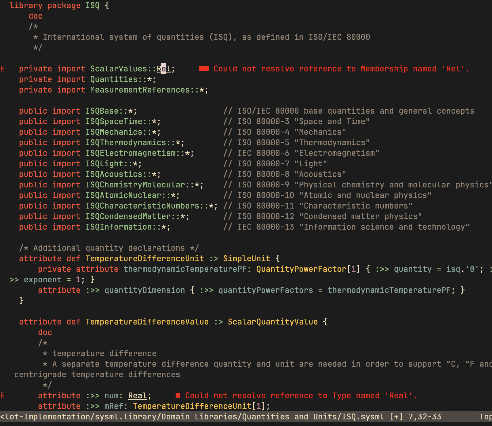

# sysmlv2.nvim

> [!WARNING]
> 🚧 This is a work in progress. 🚧

<div align="center">

<p><i>SysMLv2 Plugin</i></p>
</div>

## vim Features

* Simple SysML/KerML Syntax Highlighting

## nvim Features

* Simple SysML/KerML Syntax Highlighting
* [sysml-2ls](https://github.com/sensmetry/sysml-2ls) LSP (Semantic Analysis)

## vim: Installation

Install with your plugin manager of choice. For example, with [vim-plug](https://github.com/junegunn/vim-plug):

```vim
call plug#begin()

Plug 'EthanJamesLew/sysmlv2.nvim'

call plug#end()
```

## nvim: Installation

For the sysml-2ls support, you will need to have a relatively recent Node.js version installed on your system (tested on Node.js v20.18.0).

Install with your plugin manager of choice. For example, with [packer.nvim](https://github.com/wbthomason/packer.nvim):

```lua
use { 'EthanJamesLew/sysmlv2.nvim' }
```

## Feature Roadmap

* nvim: treesitter parser and syntax highlighting
* nvim: Better sysml-2ls configuration options
